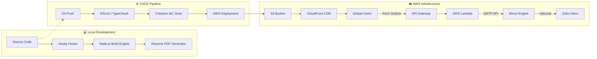

# 🚀 Modern Cloud-Native DevOps Portfolio

[](https://www.terraform.io/)
[](https://aws.amazon.com/)
[](https://github.com/features/actions)
[](https://www.checkov.io/)
[](https://opensource.org/licenses/MIT)

A production-grade, high-performance static portfolio website engineered with a **Security-First** and **Automation-Driven** mindset. This project serves as a live demonstration of modern DevOps practices, including **Infrastructure as Code (IaC)**, **Quality Gates**, and an automated **Resume-as-Code** engine.

---

## 🏗️ System Architecture

This project implements a professional **Source-to-Edge** workflow, separating source logic from build artifacts and infrastructure management.



---

## 🛠️ Tech Stack & Tooling

| Category | Tools |
| :--- | :--- |
| **Frontend** | HTML5, Tailwind CSS, Vanilla JS, Lucide Icons |
| **Automation** | Node.js (Custom Build Engine), Husky, Shell Scripts |
| **Infrastructure** | Terraform (HCL), AWS (S3, CloudFront, Route 53, ACM, Lambda, API Gateway) |
| **Communication** | Brevo (SMTP API), Zoho Mail (Domain Host), EmailJS (Failover) |
| **Security** | Checkov (IaC Scan), TFLint, ESLint, Content Integrity Validation |
| **CI/CD** | GitHub Actions (Multi-stage Pipelines) |

---

## 📂 Project Structure

```text
.
├── .github/workflows/   # CI/CD Pipeline definitions (Lint, Security, Deploy)
├── config/              # Centralized Site Content & Configuration (JSON)
├── docs/                # Architecture diagrams & technical documentation
├── public/              # Root-level static files (robots.txt, sitemap.xml)
├── scripts/             # Professional Build & Automation scripts (Node.js)
├── src/                 # Source assets (Templates, Styles, Client-side JS)
├── terraform/           # Infrastructure as Code (Modules, Security Groups, CDN)
└── dist/                # [GIT IGNORED] Production-ready build output
```

---

## 🔒 Security & Quality Gates

This project enforces high engineering standards through automated gates:
- **Shift-Left Security**: Checkov scans Terraform code for misconfigurations before deployment.
- **Code Integrity**: Custom build engine validates that no `{{PLACEHOLDERS}}` are left unreplaced in production.
- **Pre-commit Hooks**: Husky ensures data is synced and linting passes before any commit is allowed.
- **IaC Linting**: TFLint ensures Terraform follows AWS best practices and tagging policies.
- **Automated Cache Busting**: Implements cryptographic content hashing for JS/CSS assets to enable long-term immutable caching without staleness.
- **Resume-as-Code Pipeline**: Automated headless rendering (Puppeteer) with professional metadata injection (`pdf-lib`) ensuring a high-fidelity, ATS-friendly PDF is always in sync with your JSON source data.

---

## 📧 Hybrid Cloud Messaging Architecture

The v2.0.0 release introduces a professional, serverless communication pipeline designed for high deliverability and reliability.

- **Primary Route (AWS Serverless)**: Form submissions are handled by an **AWS Lambda** microservice, protected behind **API Gateway**. The service communicates with the **Brevo API** to route messages from the custom domain (`contact@shubhammate.com`).
- **Failover Route (High Availability)**: Implements an automatic client-side failover to **EmailJS** in case of primary service disruption, ensuring 100% communication uptime.
- **Security-First**: API keys and secrets are managed via **AWS Lambda Environment Variables** and **Terraform Sensitive Variables**, never exposed to the client-side code.
- **Authenticated Delivery**: Domain is hardened with **SPF**, **DKIM**, and **DMARC** records to ensure 100% inbox delivery and protection against spoofing.

---

## 👔 Resume-as-Code Engine

The portfolio includes a sophisticated career-branding pipeline that treats your professional resume as version-controlled code.

- **High-Fidelity Executive Layout**: Replicates industry-standard LaTeX styling for a premium, ATS-optimized presentation.
- **Rich Text support**: Full support for standard HTML tags (`<b>`, `<i>`, `<u>`) directly within `site-config.json` for precise typographic control.
- **Automated PDF Metadata**: Injects professional metadata (Title, Author, Producer) into the final PDF artifact during the build process.
- **Localized Asset Sync**: Manages professional certifications and documents within a localized asset vault for high-speed delivery and reliable verification.

---

## 🚀 Getting Started

### Prerequisites
- Node.js (v20+) & npm
- Terraform (v1.5+)
- AWS CLI configured with appropriate permissions

### 1. Installation
```bash
git clone https://github.com/shubhmate/cloud-native-portfolio.git
cd cloud-native-portfolio
npm install
```

### 2. Local Development
```bash
# Start dev server with hot-reload simulation
npm run dev
```

### 3. Build & Test
```bash
# Fetch latest GitHub data and generate production build
npm run fetch
npm run build
```

---

## ☁️ Infrastructure Deployment

### Phase 1: Local Simulation
Test the deployment logic locally using **LocalStack**:
```bash
npm run localstack:start
npm run deploy:localstack
```

### Phase 2: AWS Production
1. **Initialize Terraform**:
   ```bash
   cd terraform
   terraform init
   terraform apply
   ```
2. **Configure CI/CD**: Add `AWS_ACCESS_KEY_ID` and `AWS_SECRET_ACCESS_KEY` to GitHub Actions Secrets.
3. **Automated Updates**: Push any change to the `main` branch to trigger the automated build engine (Tailwind compilation + Asset Hashing) and global CloudFront invalidation.

---

## 📜 License
Distributed under the **MIT License**. See `LICENSE` for more information.

---

**Crafted with ❤️ by [Shubham Mate](https://shubhammate.com)**
*"Automating the world, one commit at a time."*